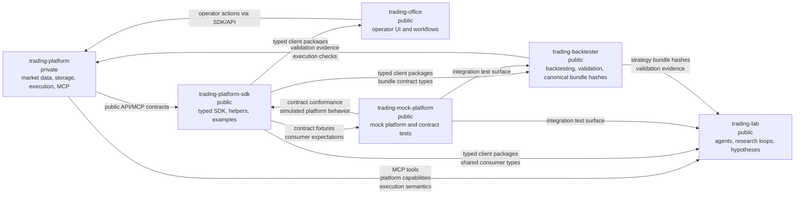

# Ecosystem Map

`trading-control-center` coordinates a six-repository trading ecosystem. The
source repositories own implementation and runtime behavior; this repository owns
the shared map, architectural invariants, rollout rules, and operational memory.

## Repository And Data Flow

## Repository Roles

`trading-platform` is the private core platform. It owns market data ingestion,
storage, execution behavior, API behavior, and the MCP surface exposed to agent
systems. It stays agent-agnostic: platform capabilities are expressed as stable
server behavior and public integration surfaces, not as assumptions about a
specific agent implementation.

`trading-platform-sdk` is the public SDK repository and the canonical consumer
contract surface. It owns client-facing packages, shared types, helpers, examples,
and version metadata. Platform capabilities that are intended for consumers must
be reflected here before downstream repositories treat them as stable.

`trading-lab` is the public agent and research workflow repository. It owns agent
loops, hypothesis generation, research sessions, and orchestration code. It
consumes platform capabilities through MCP and SDK packages; it must not import
private platform internals.

`trading-office` is the public operator UI and office workflow repository. It owns
human operator flows, UI sessions, and operational actions. It consumes SDK/API
surfaces and propagates correlation identifiers so operator actions can be traced
through platform telemetry.

`trading-backtester` is the public validation and backtesting repository. It owns
backtest jobs, evidence-oriented validation flows, strategy evaluation, and the
canonical authority for strategy bundle hashes. Changes to the strategy bundle
contract start here and then propagate to SDK and consumers.

`trading-mock-platform` is the public mock and simulated platform repository. It
owns contract test doubles and integration-test platform behavior. It must conform
to SDK and platform contracts; it is not the source of truth for real execution
semantics.

## Repository Catalog

| Repo name | Visibility | Role | Primary consumers |
| --- | --- | --- | --- |
| `trading-platform` | Private | Core platform: market data ingestion, storage, execution engine, MCP surface, API behavior. | `trading-platform-sdk`, `trading-lab`, `trading-office`, `trading-backtester`, `trading-mock-platform` |
| `trading-platform-sdk` | Public | Canonical SDK contract: client packages, shared consumer types, helpers, examples, version metadata. | `trading-lab`, `trading-office`, `trading-backtester`, external SDK users, `trading-mock-platform` |
| `trading-lab` | Public | Agent workflows, research loops, hypothesis generation, MCP/SDK consumer. | Researchers, agent operators, backtesting workflows |
| `trading-office` | Public | Operator UI, office workflows, human operational actions. | Operators, support workflows, platform operations |
| `trading-backtester` | Public | Backtesting, validation flows, evidence records, canonical strategy bundle hashes. | `trading-lab`, platform release validation, SDK compatibility checks |
| `trading-mock-platform` | Public | Mock/simulated platform surface for contract and integration testing. | SDK tests, lab integration tests, backtester integration tests |

## Integration Boundaries

### MCP Boundary

MCP is the primary integration boundary between `trading-platform` and agent-side
systems. Platform tool calls, capability discovery, agent-triggered execution
requests, and agent-observable platform responses cross this boundary. Agent
session identifiers, MCP tool-call identifiers, and trace identifiers must cross
with each call so lab traces can be linked to platform spans.

### SDK Boundary

The SDK is the canonical public consumer contract owned by
`trading-platform-sdk`. Client types, helpers, examples, version metadata, and
consumer-facing compatibility guarantees cross this boundary. `trading-lab`,
`trading-office`, and `trading-backtester` should depend on SDK packages rather
than re-creating platform clients or importing platform internals.

### Backtester Bundle Boundary

`trading-backtester` owns canonical strategy bundle hashes. Bundle contract
changes cross from backtester to SDK and then to lab or other consumers. Evidence
records from backtester runs are the validation artifact for bundle-compatible
strategy execution.

### Mock Platform Boundary

`trading-mock-platform` implements mock behavior for contract and integration
tests. It consumes SDK/platform contracts and exposes simulated responses for
test environments. Its behavior must conform to public contracts, but it does not
define real platform semantics.

### Internal Boundaries

Private implementation details stay inside their owning repositories. There are
no direct imports from `trading-lab`, `trading-office`, or `trading-backtester`
into `trading-platform` internals. Cross-repo coordination happens through specs,
SDK contracts, MCP/API surfaces, validation gates, and rollout notes.
